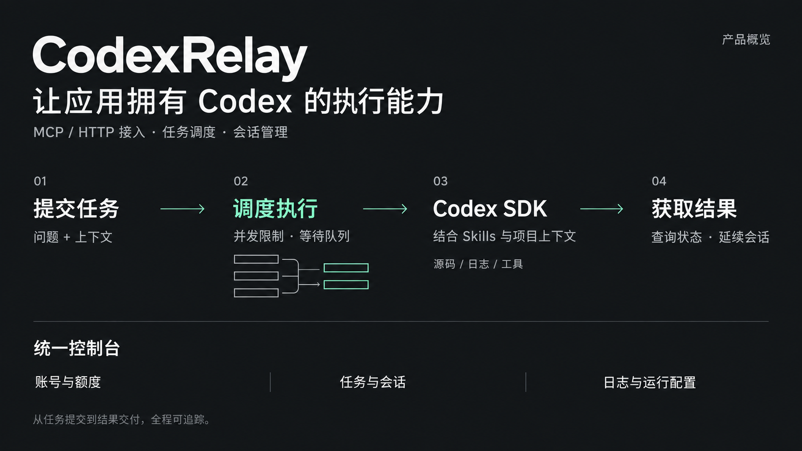
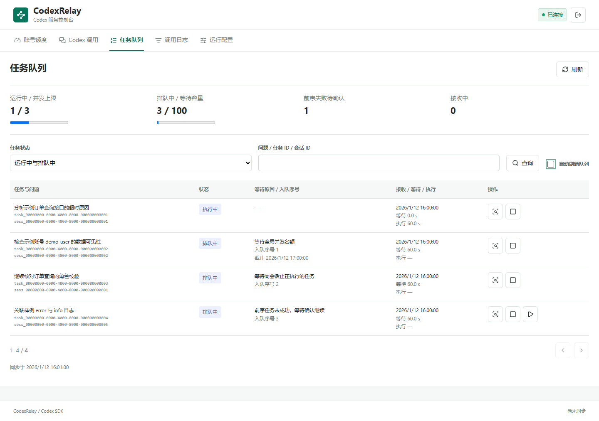
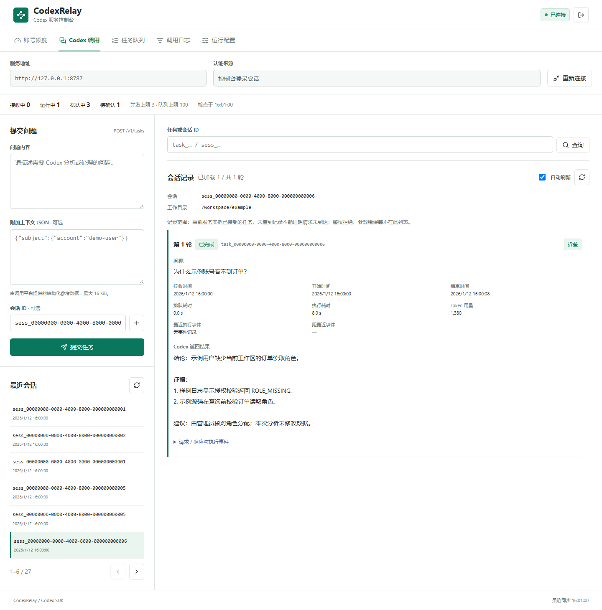

# CodexRelay

A self-hosted Codex task gateway with MCP tools, HTTP APIs, persistent sessions, bounded concurrency, and an operator console.

将 Codex 接入你的应用：提交问题后立即获得任务 ID，由服务负责排队、执行、会话续接和结果保存。项目说明与 Skills 由 Codex 原生加载，适合代码分析、日志诊断以及可扩展的运维工作流。

[快速开始](#本地运行) · [登录与额度](docs/codex-auth.md) · [完整接入示例](docs/first-task.md) · [调度机制](docs/scheduling.md) · [运维排障](docs/troubleshooting.md)



## 能做什么

- **接入简单**：`question` 必填，`context`、`sessionId`、`idempotencyKey` 可选。
- **可控执行**：全局并发、等待容量、排队期限、执行超时，同一会话串行。
- **保留记录**：任务、会话、运行配置和可选调用日志保存在文件中，无需外部数据库。
- **便于运维**：账号额度、会话历史、队列、取消、失败重试、调用日志及配置热更新。
- **两种调用方式**：MCP Streamable HTTP / stdio，或普通 HTTP API。

当前面向**单实例、可信调用方**。提交任务时可通过 `sandboxMode` 选择 Codex SDK 原生的 `read-only`、`workspace-write`、`danger-full-access`；省略采用服务默认值，兼容默认值为完整权限。Skills 是行为说明，不是权限隔离。详见 [权限参数](docs/http-api.md#sandboxmode) 与 [安全边界](SECURITY.md)。

## 控制台预览

下图来自真实控制台界面与合成测试数据，不包含真实账号、认证文件或业务记录。




## 本地运行

需要 Node.js 22.12+、Git，以及可用的 Codex 账号或 API 认证。

```sh
npm ci
npm run init:env
npm run build
npm run check:dev
npm run codex:auth -- login
npm run codex:auth -- status
npm run start:dev
```

在克隆下来的仓库根目录运行上述命令。打开 <http://127.0.0.1:8787/>，开发控制台使用 `admin/admin`。`codex:auth` 读取开发配置的 Codex home，不会误用终端中另一套 `CODEX_HOME`。模型认证与控制台登录相互独立，详见 [登录与额度](docs/codex-auth.md)。`init:env` 创建随机服务 Token 和生产控制台密码，已有 `.env` 不会被覆盖。

开发与生产分别使用 `config/development.yaml` 和 `config/production.yaml`，启动命令为 `npm run start:dev` / `npm run start:prod`。开发数据目录保持固定；生产目录由环境变量指定。配置热更新不改变数据目录。

## Docker Compose

安装 Docker Engine / Docker Desktop（Linux 容器）与 Compose v2。生成 `.env` 后可先使用内置样例工作目录：

```sh
docker compose build
docker compose run --rm codex-mcp node dist/cli/auth.js login --config config/production.yaml
docker compose run --rm codex-mcp node dist/cli/auth.js status --config config/production.yaml
docker compose up -d
```

地址仍为 <http://127.0.0.1:8787/>；控制台密码取自 `.env` 的 `CODEX_CONSOLE_PASSWORD`。容器认证、线程和任务持久化在 `codex-state` 卷中。配置 `CODEX_WORKSPACE_HOST` 可挂载自己的项目与 Skills。远程访问、升级、容器检查和异常恢复见 [部署文档](docs/deployment.md)。

## HTTP 调用

平台后端将环境变量中的服务 Token 放到 `Authorization: Bearer ...` 请求头，向 `POST /v1/tasks` 提交：

```json
{
  "question": "为什么这个示例账号看不到订单？",
  "context": {
    "subject": { "account": "demo-user", "tenantId": "tenant-demo-001" }
  },
  "idempotencyKey": "feedback-demo-001"
}
```

返回 `taskId`、`sessionId`、`status`，每隔 2–5 秒查询 `GET /v1/tasks/{taskId}`。追问携带 `sessionId`；同一次网络请求重发复用原幂等键，新问题使用新键。完整示例见 [HTTP API](docs/http-api.md)。

## MCP 调用

远程地址为 `http://127.0.0.1:8787/mcp`，客户端设置 Bearer Token。先调用 `codex_submit_task`，再使用 `codex_get_task` 查询结果。

| 工具 | 用途 |
| --- | --- |
| `codex_get_service_info` | 执行器、模型和调度参数 |
| `codex_submit_task` | 提交问题或追问 |
| `codex_get_task` | 查询状态、进度及结果 |
| `codex_cancel_task` | 取消排队中或运行中的任务 |
| `codex_list_sessions` | 分页查看会话 |
| `codex_get_session` | 查看会话和任务摘要 |

[MCP 接入指南](docs/mcp.md) 提供客户端代码、stdio 设置和错误处理。

## 多请求如何处理

部署方主要设置 `maxConcurrent`（运行上限）和 `maxQueued`（等待容量）。HTTP 与 MCP 进入同一个队列；同会话自动串行，不需要调用方配置更多限额。

例如并发设为 2，依次收到 A1、A2、B1，其中 A1/A2 属于同一个会话：A1 和 B1 可同时执行，A2 等 A1 完成后再继续。其他会话不会被 A2 挡住。

| 情况 | 服务行为 |
| --- | --- |
| 并发已满 | 接受任务并排队；容量耗尽时明确返回 429 |
| 网络断开后重发 | 相同参数和幂等键返回同一任务 |
| 前序失败 | 同会话已排队的追问等待确认，其他会话继续 |
| 排队超过期限 | 记录超时，保留任务供排查 |
| 服务重启 | 恢复有效排队任务；运行中断的任务不自动重跑 |
| 运维取消运行任务 | 等执行进程退出后再释放并发名额 |

控制台可查看每个等待任务的原因。默认生产并发为 3、等待容量为 100；提高并发不增加账号额度。参数生效时机、恢复流程和验证边界见 [调度文档](docs/scheduling.md)。

## 扩展到自己的项目

在服务工作目录中放置 `AGENTS.md` 和 `.agents/skills/<name>/SKILL.md`，按 Codex 原生方式配置上游 MCP 工具。调用方不需要传工作目录或模型参数。

```text
your-workspace/
  AGENTS.md
  .agents/skills/log-evidence/SKILL.md
  src/
```

部署设置、模型与推理强度见 [配置说明](docs/configuration.md)。示例目录 `examples/workspace` 只包含合成证据。

默认工作目录中保留两个公开 Skill：`log-evidence` 演示日志分析，`acceptance-ledger-check` 用于验证 Skill 加载和源码关联。自定义 Skill 请新建在 `examples/workspace/.agents/skills/<你的技能名>/SKILL.md`；更换工作目录后，放到新工作目录的 `.agents/skills/` 下。目录名是 `.agents`，不是 `.agent`。

本仓库的 `.gitignore` 默认忽略其他 `.agents/skills/` 和 `.codex/skills/` 文件，只放行上述公开示例的指定文件。请不要将私人配置写进这些已公开的示例文件；已跟踪文件的修改不会被 `.gitignore` 隐藏。外部项目需自行设置 Git 忽略规则。

## 开发与验证

```sh
npm run verify
npm run release:check
npx playwright install chromium
npm run smoke:browser
```

CI 配置涵盖 Windows、macOS、Linux，以及容器构建检查和 Git 历史秘密扫描。测试使用受控执行器，不消耗真实模型额度。实际验证范围记录在 [验证说明](docs/verification.md)。

## 文档与边界

- [部署与登录](docs/deployment.md) · [MCP](docs/mcp.md) · [HTTP API](docs/http-api.md)
- [账号认证与额度](docs/codex-auth.md) · [第一个任务](docs/first-task.md) · [排障手册](docs/troubleshooting.md)
- [架构图](docs/architecture.md) · [调度与恢复](docs/scheduling.md) · [配置](docs/configuration.md)
- [贡献指南](CONTRIBUTING.md) · [安全说明](SECURITY.md)

一个数据目录只能由一个服务实例占用。取消不会撤销已发生的外部操作；重试创建新会话并保留原失败记录。调用日志保留期不负责删除任务历史与 Codex 原生线程。

## 许可证与发布状态

[MIT](LICENSE)。`private: true` 仅防止误发 npm；源码和 Docker 部署不受此字段影响。CodexRelay 是独立项目，不是 OpenAI 官方产品。

当前作为 `0.1.0` 初版验证。已完成与待完成的检查见 [验证说明](docs/verification.md) 和 [发布检查表](docs/release-plan.md)。目标平台与容器验收结果以实际运行记录为准。
