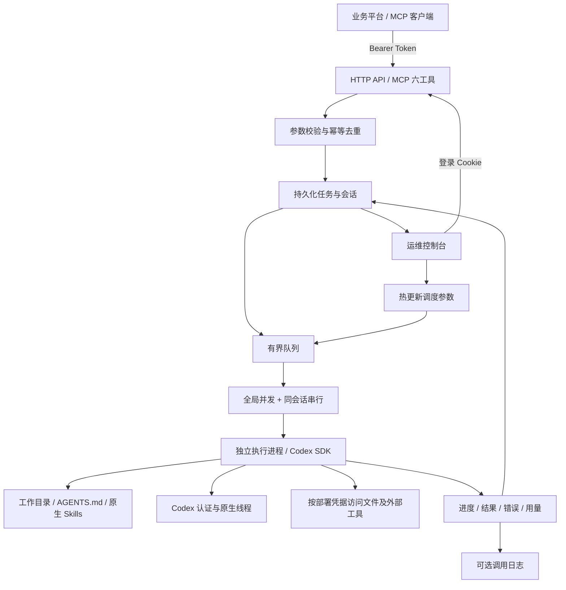
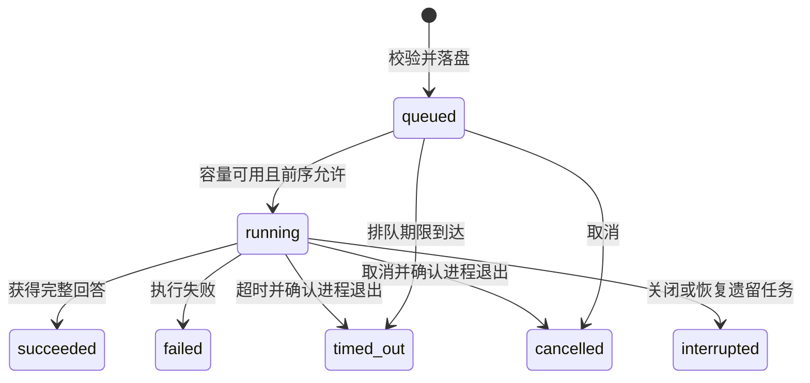

# 架构与任务生命周期

服务层 `src/service.ts` 统一处理 HTTP 与 MCP 提交。`src/storage.ts` 以原子 JSON 写入保存任务与会话，并阻止两个实例共享同一存储目录。

失败前序会阻塞同会话后续任务，其他可运行会话仍可使用空闲名额。运维确认继续只放行后续任务；“新会话重试”会新建任务并记录 `retryOfTaskId`。

| 目录 | 内容 | 保留方式 |
| --- | --- | --- |
| `dataDir` | 任务、会话、实例锁、运行配置覆盖 | 持久保存；管理员备份与归档 |
| `invocationLog.directory` | 按日期和任务组织的调用日志 | 开关与保留天数可热更新 |
| `codex.home` | 模型认证、原生线程、原生配置 | 独立持久保存，不纳入版本库 |
| 工作目录 | 项目源码、AGENTS.md、Skills | 由部署者挂载或配置 |

当前是单实例架构：不要求 Redis 或数据库，也不支持跨实例共享队列。额度面板读取的是当前 Codex 账号共享额度，不能视为某个实例独享的预算。
