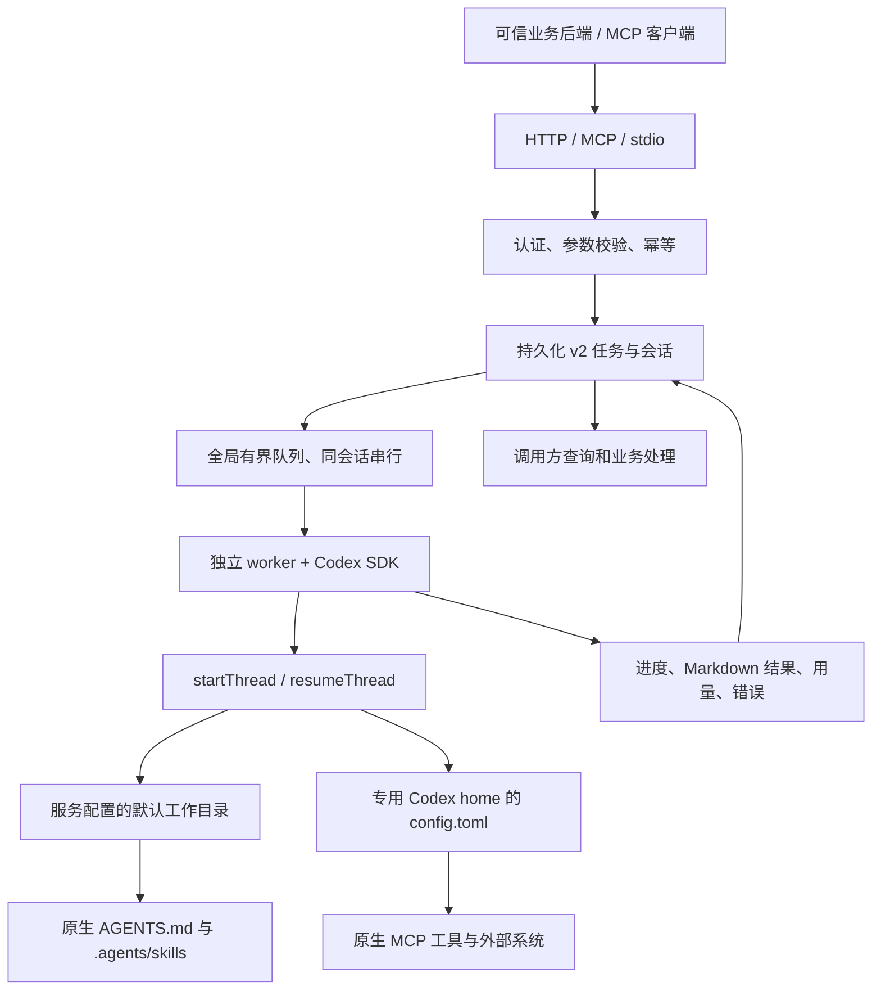

# 原生 Codex SDK 任务网关设计

## 定位

CodexMCP 是给可信业务后端使用的单机任务网关。它把原生 Codex SDK 的任务执行接入 HTTP/MCP，提供有界队列、会话索引和持久化结果，不重新实现 skill 系统，不按 capability 分发问题。

网关不内置公司业务规则，不直接承担业务数据库写入、消息推送或用户授权。调用方收集问题与可选业务上下文并控制请求准入和结果访问；管理员通过服务配置固定工作目录和模型设置，Codex 使用原生项目上下文和完整执行能力处理任务。

实现采用 Node.js 22.12+、TypeScript、官方 Codex SDK 与 MCP SDK；一个调度进程管理独立 worker，文件存储不要求 Redis 或数据库。以下为新架构契约，验证进展见 [验收记录](verification.md)。

## 职责分层

| 层 | 职责 | 不负责 |
| --- | --- | --- |
| 可信业务后端 | 用户身份、上下文生成、结果授权、脱敏、业务入库或通知 | 向普通前端下发共享 Token |
| 网关 | 认证、参数校验、幂等、队列、会话、取消、超时、存储 | 扫描、拼接或路由 skill；复杂 RBAC |
| Codex SDK / CLI | 原生线程、项目说明、skill 发现与使用、原生 MCP 配置 | 网关业务会话的对象授权 |
| 调用方 / 部署环境 | 请求过滤、运行账户、容器、外部凭据和访问审计 | 依赖网关裁剪 Codex 能力 |

## 调用链路

原生线程的创建与恢复使用 SDK，不把历史问题重新拼接成自制对话。参见 [官方 Codex SDK](https://learn.chatgpt.com/docs/codex-sdk)。

## 会话契约

提交契约严格限定为必填 `question`，以及可选 `context`、`sessionId`、`idempotencyKey`、`sandboxMode`。`context` 必须是 JSON 对象，最多 16 KiB，由可信业务后端生成并作为不可信参考数据交给 Codex，不能作为指令或权限来源。工作目录、供应商、模型和推理强度不属于请求参数；新会话读取当前全局配置并保存。已接收任务保留提交时的配置，切换全局模型后旧会话追问需新建会话，不会悄悄跨供应商续接。

业务 `sessionId` 映射到内部 Codex thread ID，二者不混用。无效 session 不静默创建新线程。同一幂等键和相同参数返回原任务，参数改变报冲突；幂等键不是会话 ID，也不保证上游模型计费的全链路 exactly-once。

MCP 的连接状态不承载业务会话。`codex_get_service_info` 与 `/v1/info` 提供服务信息，不提供项目白名单、skill 注册表或能力路由。全部六个工具见 [接口文档](api.md)。

## 原生上下文

任务工作目录中的 `AGENTS.md` 放项目说明，`.agents/skills/<名称>/SKILL.md` 放原生 skill。示例路径为 `examples/workspace/AGENTS.md` 和 `examples/workspace/.agents/skills/log-evidence/SKILL.md`。

service 不扫描 skill、不合并文件为 developer instructions，也不根据问题路由 skill。仓库级发现沿 Codex 任务工作目录至仓库根目录，不是任意 service 源目录。上游 MCP 在专用 `codex.home/config.toml` 配置，不再由 YAML 的能力项注入。

## 调度和存储

默认 `tasks` 为 `maxConcurrent: 10`、`maxQueued: 100`、`timeoutSeconds: 600`。同一会话最多一个执行进程，等待该会话的任务不应阻塞其他可运行会话。队列满时拒绝提交，不能留下因拒绝而创建的孤立会话。

状态流转：`queued -> running -> succeeded / failed / cancelled / timed_out / interrupted`。取消或超时必须等执行进程退出后才释放名额；SDK 中断无效时终止进程树，不能因 Promise 提前返回而超卖并发。

任务接受响应须在持久化后返回。单实例锁防止多个调度器共享文件存储；单文件原子替换不代表多个文件之间具有事务原子性。存储失败不能伪报接受或成功，应停止不安全的调度。

新记录为 `version: 2`。开发配置固定使用 `data/native-logs-preview`，生产配置使用 `CODEX_DATA_DIR` 指定的独立目录；两者不自动聚合。原生 Codex 线程和认证位于各自的 `codex.home`，备份需同时覆盖任务数据与线程数据。历史 v1 任务和会话保留查询，v1 会话不能续接，v1 queued 不能恢复执行，不删除旧数据。

重启不重跑遗留 running；将其标为中断。仅新 v2 queued 在通过恢复校验后可继续排队，不能把这一行为扩展到 v1。详见 [运维说明](operations.md)。

## 固定执行能力与范围

执行使用请求的 `sandboxMode`，省略时采用服务默认值，支持 SDK 原生的 `read-only`、`workspace-write`、`danger-full-access`。模式按任务保存，排队恢复与失败重试保留原值；同会话不同轮次可以各自指定，不修改历史任务。审批保持 `never`，不自动扩大权限；枚举范围见 [接口说明](http-api.md#sandboxmode)。

共享 Token 对应一个可信接入域，可见全部任务。固定工作目录不是访问授权或文件边界。调用方负责请求过滤；Codex 能实际操作的资源由服务进程、容器、操作系统账户、网络和外部凭据决定。

本版不提供复杂 RBAC、多租户隔离或集群调度。请求权限使用 Codex 原生沙箱，不实现自有沙箱。保留 Runner/Store 扩展点不等于这些功能已实现或已验证。
